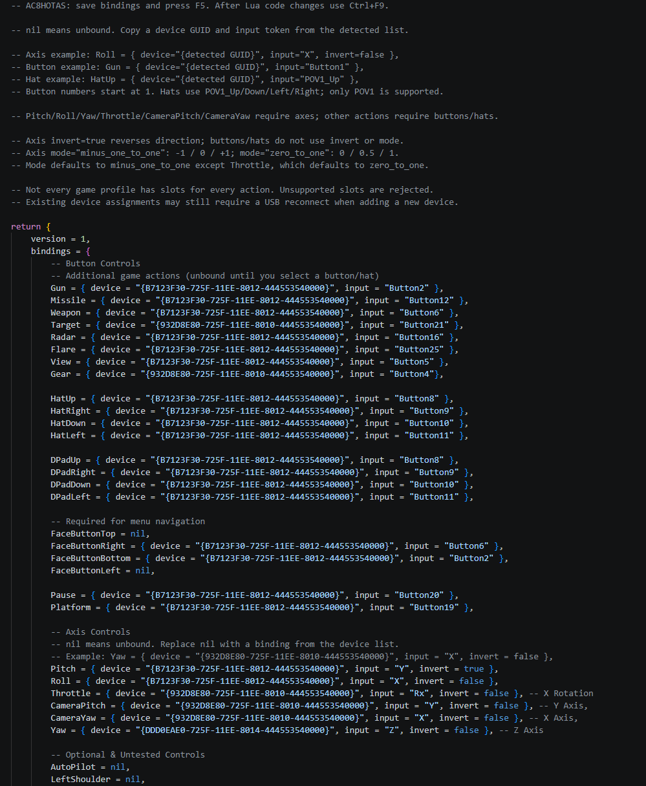
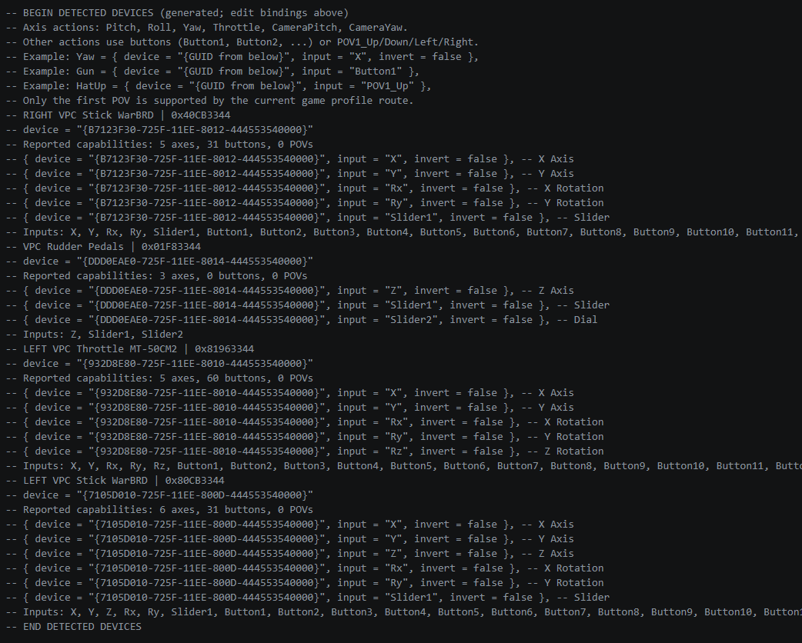

# AC8HOTAS

Bind physical flight sticks, throttles and pedals to Ace Combat 8 through its
native flight-stick input system. Multiple devices can be mapped directly;
a combined virtual joystick is not required.

## Download and install

**Recommended: AC8HOTAS with AC8AnalogYaw.** This download includes two separate
mods: AC8HOTAS handles bindings, and AC8AnalogYaw enables proportional yaw.
A HOTAS-only download is also available for users who already have analog yaw
or prefer the game's existing yaw behaviour.

**New to UE4SS?** Choose `AC8HOTAS-0.2.0-full-install.zip`, which also includes
the tested loader and enables both mods. Follow its `INSTALL-FULL.md`: copy its
Game folder into the game installation, launch, configure bindings and press F5.
Use this package only for a fresh installation without an existing loader.

The other downloads require UE4SS separately. Follow [INSTALL.md](INSTALL.md) for installation,
configuration, updates and troubleshooting. The bundled yaw mod is version 0.1.3
from [AC8AnalogueYaw](https://github.com/Drumsmasher17/AC8AnalogueYaw).

## Configure your controls

Start the game once with your controllers connected. AC8HOTAS lists detected
devices and their available axes, buttons and hats at the bottom of its
`bindings.lua`. All 49 action entries start unbound, grouped into flight buttons,
hats, menu controls, axes and optional controls.

Copy a device binding from the generated list into an action, save the file,
and press **F5** in the game. You can edit and apply bindings during the same
session without restarting. At startup and on F5, AC8HOTAS clears the built-in
Windows flight-stick assignments and actions in memory, then assigns clean
compatible game profile slots from this file. The game does not save these
changes; restarting without AC8HOTAS restores its original profiles. There is
no separate reset key. For example:

```lua
Roll = { device="{detected GUID}", input="X", invert=false },
Throttle = { device="{detected GUID}", input="Rx", invert=false },
Gun = { device="{detected GUID}", input="Button1" },
HatUp = { device="{detected GUID}", input="POV1_Up" },
```

- `nil` leaves an action unbound.
- `invert=true` reverses an axis.
- `mode="minus_one_to_one"` produces -1 / 0 / +1. This is the default for most axes.
- `mode="zero_to_one"` produces 0 / 0.5 / 1. This is the default for Throttle.
- Buttons and hats do not use `mode` or inversion.

Use **Throttle** for a continuous throttle lever; **AccelDecel** is a button
command. Pitch, Roll, Yaw, Throttle, CameraPitch and CameraYaw accept axes.
The other actions accept buttons or first-POV hat directions.

## Configuration examples

An example configuration with flight buttons, menu controls and axes assigned
across multiple devices. The download starts with every action unbound; use your
own detected device IDs when setting up bindings. The Ctrl+F9 shortcut shown is
specific to the development setup; F5 reloads bindings in the released mod.



The generated section at the bottom of the same file lists detected controllers,
their capabilities and binding values you can copy into the editable section above.



## Current limitations

F5 refreshes the mod's device inventory and bindings. Assigning a newly
connected device can still require a USB reconnect because the game may cache
device discovery.
Controllers sharing the same product ID cannot currently be mapped separately.
Only the first POV hat is supported, and axis deadzones are not configurable.

The list exposes the game's action names, but their effects depend on context.
If a device's native template lacks an action, AC8HOTAS can reuse another
built-in flight-stick profile slot that has it. If no available slot has the
requested action, the config is rejected before profile changes are applied.
Optional actions and physical POV hats have not all been tested.

Game updates may break either mod. AC8AnalogYaw hooks native game code and checks
the target before applying; a changed game build can still cause incompatibility
or a crash. Disable it and restart if necessary. See the included yaw README.

## Development

Run `build.cmd` with Visual Studio C++ Build Tools installed. It builds the
DirectInput device catalog DLL and a standalone scanner. The scanner enumerates
capabilities; it does not acquire controllers or inject input.

With Python and `lupa` installed, run `python tests/test_mapper.py`. Run
`powershell -ExecutionPolicy Bypass -File package.ps1` to build releases, then
`python tests/test_package.py` to verify their contents. Packaging requires the
separate AC8AnalogYaw 0.1.3 ZIP; see [PUBLISHING.md](PUBLISHING.md).

F5 reloads configuration only. UE4SS Lua hot reload can be enabled separately for
script development; native DLL updates require a game restart. Numbered logs
contain startup, explicit reload, lifecycle changes and errors, with no periodic
input tracing. F7 writes a read-only flight-stick profile snapshot on demand.
See [VALIDATION.md](VALIDATION.md) for testing scope.

## License

AC8HOTAS's own code and documentation are dedicated to the public domain under
**CC0 1.0 Universal**, to the extent permitted by law. You can copy, modify,
redistribute and use them commercially without asking permission or giving credit.
Attribution is appreciated but not required. See [LICENSE](LICENSE) for the full terms.

This mod was developed with AI assistance and is provided without warranty.
The CC0 dedication applies only to rights the contributor can waive; it does not
claim ownership of the game or third-party components.

The bundled AC8AnalogYaw mod also uses CC0 for its own code. Its MinHook dependency
keeps its separate BSD license and required notices. See
[THIRD_PARTY_NOTICES.md](THIRD_PARTY_NOTICES.md). The full-install download also
includes UE4SS under its MIT license. No game assets are distributed.
